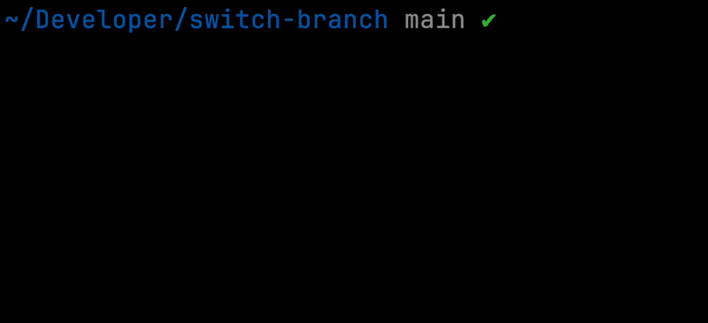

# Switch Branch

CLI tool to preview and switch to recent git branches.



## Installation Mac

- Go to [releases](https://github.com/oscarheimdahl/switch-branch/releases) and download the latest version.
- Make the binary executable: `chmod +x switch-branch`
- Include it in your path, one way: `mv switch-branch /usr/local/bin`
- Done! ✅

## How it works

It simply runs the following commands for you:

```
git for-each-ref --sort=-committerdate
git checkout {selectedBranch}
```

## Flags

You can change color of the header (because of course you can...)

#### Header background color

`-b` or `--bg` or `--background` followed by a number

#### Header text color

`-t` or `--txt` or `--text` followed by a number

#### Available colors

- 0 (no color)
- 1 (white)
- 2 (black)
- 3 (blue)
- 4 (green)
- 5 (yellow)
- 6 (magenta)
- 7 (cyan)
- 8 (red)

### Example

```
switch-branch -b 1 -t 2
```

Will yield a header with a white background and black text.
